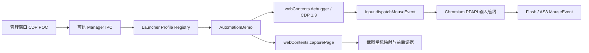

# CDP + PPAPI Flash 后台自动化 POC 验证记录

> 状态：技术可行性和最小坐标回放闭环已确认，尚未产品化
>
> 验证日期：2026-07-29
>
> 验证分支：`demo/builtin-auto`
>
> 基线提交：`4967578`
>
> 运行环境：Windows、Node.js 16.20.2、npm 8.19.4、Electron 11.5.0、Chromium 87.0.4280.141、Pepper Flash 34.0.0.376

## 1. 结论摘要

本次 POC 已证明：启动器可以通过 Electron 的 `webContents.debugger` 接口连接游戏窗口的 Chrome DevTools Protocol（CDP），向未聚焦甚至隐藏的 PPAPI Flash 内容派发鼠标事件，并满足以下核心目标：

- Flash 内的 AS3 `MouseEvent.CLICK` 被真实触发；
- 游戏窗口在点击前后均保持未聚焦；
- Windows 系统鼠标位置不发生变化；
- 不需要把游戏窗口切到前台；
- 不需要移动或占用用户的物理鼠标；
- 不依赖 Debug Flash Player；
- 不依赖 `PreloadSwf`、DisplayList 枚举或游戏公共函数分析；
- 在腾讯国服真实游戏窗口中完成了人工确认。

因此，对于“支持后台点击运行，且不会抢占鼠标”这一 Top1 需求，推荐将“启动器内置自动化 Bridge + CDP 输入后端”作为主方向。

抓包并修改游戏 SWF、注入 AS3 Agent、寻找游戏公共函数的路线仍有研究价值，但不应作为后台点击功能的前置条件。

## 2. 问题背景与验收标准

原有外部自动化通常依赖操作系统级鼠标模拟。其主要问题是：

1. 游戏窗口必须处于前台；
2. 自动化过程会移动或占用用户鼠标；
3. 用户操作会与脚本互相干扰；
4. 多账号窗口无法可靠并行；
5. 窗口遮挡、焦点切换和分辨率变化容易导致误操作。

本次研究将最小验收标准定义为：

| 编号 | 验收项                                          | 结果               |
| ---- | ----------------------------------------------- | ------------------ |
| A1   | 能向普通 Chromium 页面派发后台点击              | 通过               |
| A2   | 能向当前 PPAPI Flash 插件派发后台点击           | 通过               |
| A3   | AS3 收到真实 `MouseEvent.CLICK`                 | 通过               |
| A4   | 点击过程中游戏窗口保持未聚焦                    | 通过               |
| A5   | 点击过程中系统鼠标位置不变                      | 通过               |
| A6   | `wmode=direct` 下有效                           | 通过               |
| A7   | 高 DPI 下截图坐标能映射到内容坐标               | 通过               |
| A8   | 腾讯国服真实游戏控件响应点击                    | 通过，用户人工确认 |
| A9   | 不依赖 Debug Player/PreloadSwf                  | 通过               |
| A10  | 截图记录坐标 → JSON → 独立脚本 → PPAPI 连续点击 | 通过，本地自动验证 |
| A11  | 腾讯真实游戏按 JSON 顺序连续点击                | 通过，用户人工确认 |

## 3. 调研路线及最终判断

### 3.1 路线一：PreloadSwf / AS3 Agent

研究 Demo 准备了以下组件：

- `FlashProbe.as` / `FlashProbe.swf`；
- 本地 TCP Server；
- Pepper Socket Policy 响应；
- 启动器 IPC；
- DisplayList 快照协议；
- Debug 模式下临时生成 `mm.cfg`。

实际验证结果为：

- Electron 11 和当前 PPAPI Flash 可以正常运行游戏；
- 当前 `pepflashplayer.dll` 为普通发布版，检测结果 `IsDebug=False`；
- F5 或重新加载游戏时没有出现预期 TCP 连接；
- `PreloadSwf` 没有进入游戏 Stage；
- 无法继续验证 DisplayList 枚举或公共函数访问。

因此，这条路线的准确结论是“研究基础设施已准备，但当前普通 PPAPI 环境未执行调试预加载机制”，不能描述为成功。

该路线即便未来解决 Debug Player 问题，仍然存在以下成本：

- 需要适配不同游戏版本的类名和 DisplayList；
- 需要持续寻找并验证动作对应的公共函数；
- 游戏更新后容易失效；
- 注入、跨域和安全沙箱行为更加复杂；
- 与“只解决后台输入”的目标相比工程投入过大。

### 3.2 路线二：启动器 Bridge + CDP

Electron 的 `webContents.debugger` 可以直接连接某个 `BrowserWindow` 对应的 Chromium Target。POC 使用 CDP 1.3 协议并发送：

```text
Input.dispatchMouseEvent(mouseMoved)
Input.dispatchMouseEvent(mousePressed)
Input.dispatchMouseEvent(mouseReleased)
```

这些事件由 Chromium 输入管线送入页面和 PPAPI 插件，不经过 Windows 的全局鼠标 API，因此不会移动物理鼠标。

腾讯真实游戏验证成功后，可以确认这条链路不仅适用于普通 DOM，也能进入当前游戏使用的 Pepper Flash。

### 3.3 对照发现：不聚焦的 `sendInputEvent`

在本地 PPAPI 靶场的中间对照实验中，移除旧 Demo 的 `win.focus()` 后，直接调用 Electron `webContents.sendInputEvent` 也能在未聚焦窗口中触发 AS3 点击，同时不移动系统鼠标。

这说明旧 Demo 的“抢焦点”至少部分来自显式执行 `win.focus()`，并不代表 `sendInputEvent` 本身一定要求前台。

但是：

- 腾讯真实游戏已经人工确认基础 CDP 点击和 JSON 坐标连续回放；
- 最终 POC 实现使用 CDP；
- CDP 对输入事件类型、协议返回和后续扩展的控制更完整。

产品化前可以在 Spec-Kit 设计阶段保留一次后端对比，但不建议因此推翻已经验证成功的 CDP 主路线。

## 4. POC 架构



当前 POC 的调用流程：

1. 启动器在 `SHINOBI_DEBUG=1` 时显示 `CDP POC` 按钮；
2. 管理窗口按 `profileId` 请求后台截图；
3. `Launcher` 从游戏窗口 registry 找到对应 Profile 的 `BrowserWindow`；
4. `capturePage()` 生成 PNG，并记录图片像素尺寸和窗口内容尺寸；
5. 用户点击管理窗口中的截图；
6. Renderer 把显示坐标换算为 PNG 自然像素坐标；
7. 主进程再把 PNG 像素坐标映射为 Chromium 内容坐标；
8. `AutomationDemo` 临时 attach CDP；
9. 依次派发移动、按下、释放事件；
10. CDP detach；
11. 等待 Flash 状态稳定后再次截图；
12. 返回焦点、系统光标和画面变化证据。

## 5. 关键实现细节

### 5.1 Debug 隔离

POC 只在以下环境变量精确为 `1` 时启用：

```powershell
$env:SHINOBI_DEBUG='1'
```

普通启动不会注册或暴露 Demo 自动化接口，避免研究接口意外成为生产攻击面。

### 5.2 Profile 与窗口绑定

所有点击都通过 `Launcher` 内已有的游戏窗口 registry 定位：

```text
profileId -> registry entry -> BrowserWindow -> webContents
```

管理窗口 IPC 同时验证：

- 调用者必须是当前 ManagerWindow 的 `webContents`；
- `profileId` 必须是字符串；
- Profile 必须真实存在；
- 游戏窗口必须仍然打开；
- 坐标必须是有限数字。

这保持了不同账号窗口和 Electron Partition 的既有隔离边界。

### 5.3 高 DPI 坐标映射

`capturePage()` 返回的 PNG 尺寸可能是物理像素，而 CDP 输入使用 Chromium 内容坐标。Windows 显示缩放为 200% 时，本地测试观察到：

```text
window.devicePixelRatio = 2
BrowserWindow content ≈ 307 × 145
capturePage PNG = 614 × 290
```

因此不能把截图像素坐标原样传给 CDP。POC 使用：

```text
inputX = floor(imageX * contentWidth / imageWidth)
inputY = floor(imageY * contentHeight / imageHeight)
```

管理界面的截图还可能经过 CSS 缩放，所以 Renderer 先根据 `naturalWidth`、`naturalHeight` 和 `getBoundingClientRect()` 还原 PNG 坐标。

坐标映射是本次成功的关键之一。

### 5.4 CDP 生命周期

POC 对每次点击执行短连接：

1. 检查 `webContents.debugger.isAttached()`；
2. `attach('1.3')`；
3. 发送三个鼠标事件；
4. 在 `finally` 中 detach。

如果游戏窗口已经打开 DevTools，CDP debugger 可能已被占用，POC 返回：

```text
cdp-already-attached
```

POC 不会强制断开已有调试会话。

### 5.5 点击证据

每次点击记录：

- 点击前游戏窗口是否聚焦；
- 点击后游戏窗口是否聚焦；
- 点击前系统光标屏幕坐标；
- 点击后系统光标屏幕坐标；
- CDP 使用的截图坐标和内容坐标；
- 点击前截图；
- 点击后截图；
- 两张位图的变化像素数和比例。

截图写入：

```text
<Electron userData>/automation-demo/
```

本地 PPAPI 冒烟测试的截图写入：

```text
%TEMP%/shinobi-cdp-ppapi-smoke/
```

## 6. 自动验证设计

### 6.1 普通 Chromium 隐藏窗口

`tests/runtime/cdp-background-smoke.js` 创建 `show:false` 的本地 BrowserWindow，使用 CDP 点击一个 HTML 按钮，并检查：

- DOM 点击计数为 1；
- 窗口点击前后均未聚焦；
- 系统鼠标坐标不变。

验证结果：

```json
{
  "electron": "11.5.0",
  "chrome": "87.0.4280.141",
  "clickCount": 1,
  "focusBefore": false,
  "focusAfter": false,
  "backgroundFocusPreserved": true,
  "cursorPreserved": true,
  "ok": true
}
```

### 6.2 真实 Pepper Flash 隐藏窗口

为了避免把“普通网页成功”等同于“Flash 成功”，POC 增加了本地、可审计的 AS3 点击靶场：

- `CdpClickTarget.as`：绘制橙色按钮；
- AS3 `MouseEvent.CLICK` 更新计数并把按钮改为绿色；
- `ExternalInterface` 把 ready 和 clickCount 报告给宿主页；
- `CdpClickTarget.swf`：由仓库中的源码通过 Apache Flex 编译；
- `wmode=direct`；
- BrowserWindow 使用 `show:false`；
- 使用项目随附的 `pepflashplayer.dll`。

最终结果：

```json
{
  "electron": "11.5.0",
  "chrome": "87.0.4280.141",
  "flashVersion": "34.0.0.376",
  "flashReady": true,
  "devicePixelRatio": 2,
  "clickCount": 1,
  "pixelsChanged": true,
  "focusBefore": false,
  "focusAfter": false,
  "backgroundFocusPreserved": true,
  "cursorPreserved": true,
  "ok": true
}
```

其中 `clickCount=1` 来自 AS3 内部的真实事件处理，不只是 DOM 层事件或截图变化推断。

### 6.3 腾讯真实游戏

最终通过 Debug 管理界面：

1. 对已进入游戏的 Profile 后台截图；
2. 在管理窗口点击截图中的真实游戏目标；
3. CDP 向后台游戏窗口派发点击；
4. 游戏执行预期动作；
5. 管理界面显示焦点保持和光标保持通过；
6. 用户确认“确实成功了”。

因此，技术链路已经跨过“本地模拟 Flash”与“腾讯实际游戏”两层验证。

### 6.4 坐标记录与独立脚本回放

在基础 CDP POC 上增加了一个刻意受限的最小闭环：

```text
获取截图
  -> 用户只在截图上记录 1～2 个点
  -> 转换为内容区域归一化坐标
  -> 自动保存 Profile 专用 JSON
  -> automation-scripts/demo-click/index.js 读取记录
  -> 按每次运行时内容尺寸还原坐标
  -> CDP 后台顺序点击
```

坐标文件位于：

```text
<Electron userData>/automation-demo/demo-click/<profileId>.json
```

结构示例：

```json
{
  "schemaVersion": 1,
  "scriptId": "demo-click",
  "profileId": "runtime-ppapi",
  "points": [
    {
      "order": 1,
      "normalizedX": 0.24429967426710097,
      "normalizedY": 0.6551724137931034
    },
    {
      "order": 2,
      "normalizedX": 0.7328990228013029,
      "normalizedY": 0.6551724137931034
    }
  ]
}
```

独立脚本只能获得以下五个受限能力：

```text
loadCoordinates()
getContentSize()
clickContent(x, y)
sleep(ms)
now()
```

它不能访问 `BrowserWindow`、`webContents` 或任意 CDP method。

隐藏 PPAPI 双目标靶场的自动结果：

```json
{
  "onePoint": {
    "clickCount": 1,
    "targetOrder": ["first"],
    "inputPoints": [{ "x": 75, "y": 95 }]
  },
  "twoPoints": {
    "clickCount": 2,
    "targetOrder": ["first", "second"],
    "inputPoints": [
      { "x": 75, "y": 95 },
      { "x": 225, "y": 95 }
    ],
    "dispatchIntervalMs": 1006,
    "flashIntervalMs": 1008
  },
  "backgroundFocusPreserved": true,
  "cursorPreserved": true,
  "ok": true
}
```

这证明了本地 PPAPI 环境中的完整数据链路。该结果仍不能替代真实游戏验证，因此继续使用相同 Debug 界面完成了人工确认。

### 6.5 腾讯真实游戏坐标回放最终确认

用户在腾讯国服真实游戏中按以下闭环验证：

1. 启动器以 `SHINOBI_DEBUG=1` 启动；
2. 对运行中的 Profile 点击 `CDP POC`；
3. 点击“获取坐标”获得当前游戏截图；
4. 在截图中依次记录 1～2 个位置，记录阶段不立即操作游戏；
5. 手动把游戏恢复到适合执行动作的初始界面；
6. 回到管理窗口点击 `Run`；
7. 固定 `demo-click` 脚本从 JSON 读取坐标并后台顺序派发；
8. 用户确认测试成功。

本次人工结果确认：

- 截图记录的坐标可以在腾讯真实游戏中回放；
- 两个坐标按记录顺序触发；
- 后续坐标使用约 1000ms 的固定调度间隔；
- 运行过程不需要把游戏保持在前台；
- 游戏窗口不会主动抢回焦点；
- 系统鼠标不会被移动或占用。

至此，以下三层验证均已完成：

| 层级                  | 验证方式                       | 状态 |
| --------------------- | ------------------------------ | ---- |
| 普通 Chromium         | 隐藏窗口自动测试               | 通过 |
| 本地 Pepper Flash/AS3 | 隐藏双目标自动测试             | 通过 |
| 腾讯国服真实游戏      | 用户人工验证坐标记录与连续回放 | 通过 |

真实游戏结果属于人工验收记录，不应描述为 CI 自动测试。未来游戏版本、页面尺寸或输入行为变化后，仍需重新执行最小人工验证。

## 7. 研究过程中遇到的关键问题

### 7.1 普通 PPAPI 不执行 PreloadSwf

最初没有 TCP 连接并不是 Server 或 IPC 已经成功，而是普通发布版 PPAPI 没有执行预期调试预加载。这个结果必须保留，避免未来重复投入。

### 7.2 AIR SDK 与普通 Flash Player 编译配置不同

第一次本地靶场使用 AIR SDK 的默认 `air-config.xml` 编译。插件虽然被 Chromium 注册，但 SWF 没有按预期报告 ready。

切换到 Apache Flex 的 `flex-config.xml` 和 Flash Player 32 `playerglobal.swc` 后，SWF 才在 Pepper Flash 34 中正常执行。

复现时应明确使用普通 Flash Player 编译目标：

```powershell
.\tests\fixtures\flash\build.ps1 `
  -FlexHome 'D:\AS3Tools\flex-sdk-4.16.1' `
  -TargetPlayer '32.0'
```

### 7.3 默认 Flash Stage 缩放导致“伪失败”

靶场第一次能 ready，但 CDP 点击计数仍为 0。截图检查发现，SWF 默认 Stage 尺寸和 `SHOW_ALL` 缩放使橙色目标实际位置与源码坐标不一致，点击落在目标外。

最终通过以下方式固定坐标：

```actionscript
[SWF(width="320", height="200", frameRate="30")]
stage.align = StageAlign.TOP_LEFT;
stage.scaleMode = StageScaleMode.NO_SCALE;
```

修正后，同一 CDP 事件立即得到 `clickCount=1`。

这说明后续诊断“点击无响应”时，必须先检查截图、DPI、Flash Stage 缩放和内容尺寸，不能直接判定 CDP 或 PPAPI 不支持后台输入。

## 8. 当前 POC 的边界和风险

### 8.1 CDP 与 DevTools 互斥

`webContents.debugger` 和游戏窗口 DevTools 可能竞争同一个调试连接。产品版本必须明确：

- 自动化运行期间是否禁止打开游戏 DevTools；
- DevTools 已打开时是拒绝、排队还是提示关闭；
- debugger 意外 detach 后如何恢复。

### 8.2 并发点击

当前实现对每次点击 attach/detach。两个外部命令同时到达时，第二个命令可能收到 `cdp-already-attached`。

产品化必须为每个 Profile 建立串行命令队列。不同 Profile 可以并行，同一 Profile 应按顺序执行。

### 8.3 截图不是强语义证据

游戏动画、粒子、倒计时和背景变化都可能导致像素差异。全图像素变化只能证明画面变了，不能证明某个业务动作成功。

后续应支持：

- 指定区域的截图；
- 模板匹配或特征点；
- 等待某个视觉状态出现/消失；
- 超时与重试；
- 由脚本定义动作后的成功条件。

### 8.4 截图性能和保留

POC 为研究方便保存前后全屏截图并逐像素比较。产品版本需要：

- 限制截图频率；
- 设置磁盘配额；
- 自动清理过期截图；
- 默认不长期保留；
- 防止截图中可能出现的用户信息被非预期读取；
- 避免每次点击都做全图 JS 像素遍历。

### 8.5 窗口尺寸变化

截图后到点击前如果窗口被缩放、切换全屏或内容尺寸发生变化，旧截图坐标可能失效。生产接口应携带：

- 截图 ID；
- 截图时的 image/content 尺寸；
- 窗口 generation 或时间戳；
- 最大允许过期时间。

点击前若尺寸不一致，应拒绝或重新截图，而不是盲目映射。

### 8.6 输入语义

当前 POC 只覆盖左键单击。真实自动化还可能需要：

- mouse move；
- mouse down / mouse up；
- 双击；
- 右键；
- 滚轮；
- 键盘输入；
- 按下和释放之间的可配置延迟；
- 鼠标悬停后再点击。

这些能力应逐项验证，不应从左键单击成功直接推断全部输入都已支持。

## 9. 产品化建议

### 9.1 推荐模块边界

建议从 POC 中拆出正式的自动化模块：

```text
src/automation/
  AutomationService.js
  CdpInputBackend.js
  CaptureService.js
  CoordinateMapper.js
  ProfileCommandQueue.js
  BridgeServer.js
  protocol.js
```

职责建议：

- `AutomationService`：面向调用者的统一 API；
- `CdpInputBackend`：CDP attach、输入派发、detach 和错误转换；
- `CaptureService`：截图、截图 ID、区域裁剪和清理；
- `CoordinateMapper`：DPI、截图和内容坐标转换；
- `ProfileCommandQueue`：同一 Profile 串行化；
- `BridgeServer`：外部进程与启动器之间的本地通信；
- `protocol`：版本化请求、响应和错误码。

### 9.2 外部 Bridge 安全边界

不建议直接暴露无认证的本地 HTTP/TCP 点击接口。建议至少满足：

- 仅监听 `127.0.0.1`，或优先使用 Windows Named Pipe；
- 每次启动生成高熵随机会话令牌；
- 令牌只通过受控方式提供给启动脚本；
- 请求必须包含协议版本；
- 只接受已打开的 Profile ID；
- 坐标、尺寸、消息长度和频率有严格上限；
- 不接收 QQ 密码、Cookie、票据或验证码；
- 不提供任意 JavaScript 执行；
- 不提供任意 CDP method 透传；
- 日志不记录截图内容和登录参数；
- 启动器退出时关闭 Bridge 并使令牌失效。

### 9.3 建议的最小外部 API

第一版只需要：

```text
listProfiles()
getWindowState(profileId)
capture(profileId, region?)
click(profileId, screenshotId, x, y)
move(profileId, screenshotId, x, y)
waitForImage(profileId, templateId, region, timeoutMs)
```

不要在第一版引入任意脚本执行、任意 CDP 命令或游戏内部函数调用。

### 9.4 推荐开发顺序

1. 抽取并测试 `CdpInputBackend`；
2. 实现每 Profile 串行队列；
3. 定义截图 ID 和失效规则；
4. 实现受限本地 Bridge；
5. 把现有外部脚本迁移到 capture/click API；
6. 增加区域截图和视觉等待；
7. 再评估是否需要键盘、拖拽、滚轮；
8. 最后才考虑 AS3 深层函数或协议级自动化。

## 10. Spec-Kit 接续建议

建议新 feature 使用名称：

```text
background-cdp-automation-bridge
```

Spec 的核心用户故事可以概括为：

> 作为自动化脚本作者，我希望通过启动器提供的受限本地接口，对指定 Profile 的 Flash 游戏窗口截图并发送输入，使脚本在窗口隐藏、被遮挡或未聚焦时继续运行，同时不改变用户当前前台窗口和系统鼠标位置。

建议写入 Spec 的强制验收条件：

1. 同一 Profile 的输入严格串行；
2. 不调用 `BrowserWindow.focus()`；
3. 不调用操作系统全局鼠标移动 API；
4. 点击前后前台窗口不改变；
5. 点击前后系统鼠标位置不改变；
6. 在 `show:false` PPAPI 测试窗口中可触发 AS3 点击；
7. 高 DPI 坐标映射有自动测试；
8. 不允许任意 CDP method；
9. Bridge 仅本机可访问且有每次启动随机凭证；
10. 不处理或暴露腾讯登录票据；
11. 多 Profile Session/Partition 隔离保持不变；
12. DevTools 冲突、窗口关闭、截图过期和命令超时有明确错误码；
13. 截图有自动清理和容量上限；
14. 无法自动覆盖的真实游戏验证步骤保持最小化。

建议在 Spec 阶段明确的决策：

- Bridge 使用 Named Pipe、WebSocket 还是 HTTP；
- CDP 长连接还是按命令 attach/detach；
- 截图 ID 的生命周期；
- 窗口最小化、隐藏和关闭的状态定义；
- 是否第一版支持键盘和滚轮；
- 自动化接口是否仅 Debug 可用，还是需要独立生产开关；
- 外部脚本的授权、发现和版本协商方式。

明确的非目标：

- 不自动扫码登录；
- 不收集 QQ 密码；
- 不读取、解密或重放登录票据；
- 不绕过验证码或腾讯风控；
- 不在第一版解析或修改游戏 SWF；
- 不在第一版调用游戏内部公共函数；
- 不承诺通过视觉像素变化自动判断所有业务动作成功。

## 11. 复现命令

完整回归：

```powershell
npm test -- --runInBand
npm run lint
```

普通 Chromium 后台点击：

```powershell
.\node_modules\.bin\electron.cmd tests\runtime\cdp-background-smoke.js
```

PPAPI Flash 后台点击：

```powershell
.\node_modules\.bin\electron.cmd tests\runtime\cdp-ppapi-background-smoke.js
```

重新编译本地 Flash 靶场：

```powershell
.\tests\fixtures\flash\build.ps1 `
  -FlexHome 'D:\AS3Tools\flex-sdk-4.16.1' `
  -TargetPlayer '32.0'
```

腾讯真实游戏 Debug POC：

```powershell
$env:SHINOBI_DEBUG='1'
npm start
```

进入游戏后，在管理窗口点击运行中 Profile 的 `CDP POC`，再点击截图中的目标。游戏窗口不应获取焦点，系统鼠标不应移动。

## 12. 最终技术判断

本次研究已经回答了最重要的问题：

> 自己维护启动器，能否利用对 Electron 游戏窗口的直接控制，解决 Flash 自动化必须前台并抢占鼠标的问题？

答案是：可以。

启动器的核心优势不是更容易修改 SWF，而是它本身拥有游戏 `BrowserWindow`、Profile registry、隔离 Session 和 `webContents` 控制权。利用这条控制链，可以在 Chromium/PPAPI 输入层完成后台操作，而无需先理解游戏内部类和公共函数。

坐标记录、Profile 专用 JSON、独立受限脚本读取以及后台连续点击的最小端到端闭环也已经在本地 PPAPI 和腾讯真实游戏中分别完成自动与人工验证。

因此后续 feature 应围绕“稳定、安全、可版本化的启动器自动化接口”展开，而不是继续把主要精力投入 Debug Player 和 PreloadSwf。
